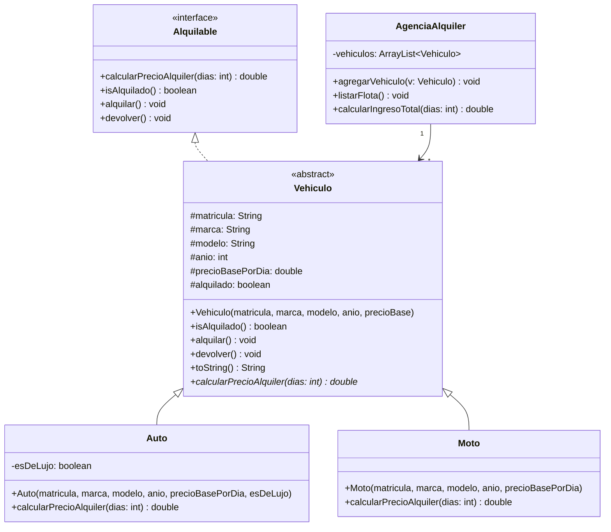

# Examen de Programación Orientada a Objetos

## Sistema de Gestión para una Agencia de Alquiler de Vehículos

Se desea desarrollar un sistema en Java para gestionar los vehículos de una
agencia de alquiler. La agencia ofrece dos tipos de vehículos: autos y motos.
Cada vehículo tiene una matrícula, marca, modelo, año de fabricación y un
precio base por día de alquiler.

El sistema debe permitir:

- Registrar que un vehículo ha sido alquilado o devuelto.
- Consultar si un vehículo está actualmente alquilado.
- Calcular el costo total de alquiler de un vehículo para una cantidad
  determinada de días. Las reglas de negocio son las siguientes:
  - Si el vehículo es un auto de lujo, el precio final tiene un recargo
    del 50 % sobre el precio base.
  - Si el vehículo es una moto y se alquila por 7 o más días, se aplica
    un descuento del 10 % sobre el precio base.
- Gestionar una flota de vehículos pudiendo agregar nuevos vehículos,
  listar todos los vehículos registrados y calcular el ingreso total que
  generaría alquilar toda la flota por una cantidad dada de días.

Se valorará el uso correcto de interfaces, clases abstractas, herencia,
polimorfismo y colecciones.

Escriba el código Java completo necesario para implementar el sistema
descrito, incluyendo una clase principal con un método `main` que demuestre
su funcionamiento con al menos cinco vehículos de distintos tipos.

### Diagrama UML

---
