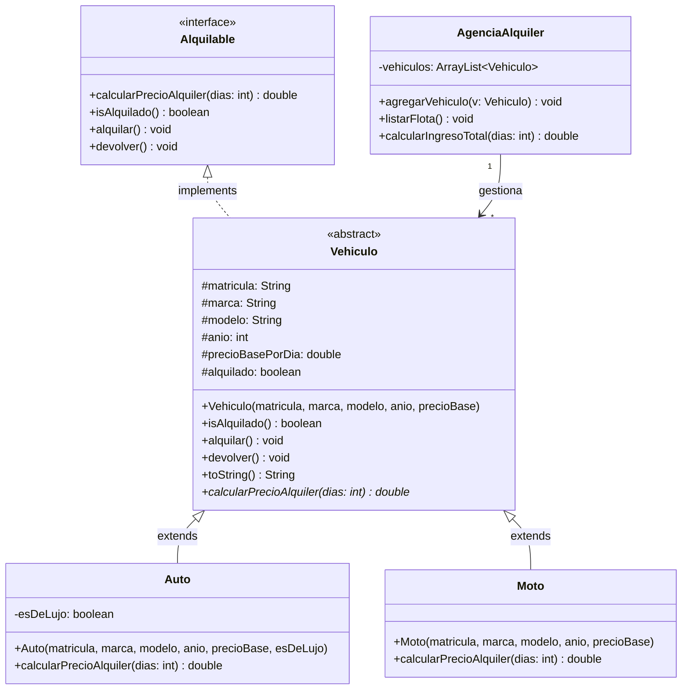

# Sistema de Gestión de Vehículos — Agencia de Alquiler

## Enunciado

Se requiere modelar un sistema para una agencia de alquiler de vehículos.
La agencia debe poder gestionar distintos tipos de vehículos (autos y motos)
y calcular el costo de alquiler según el tipo de vehículo y la cantidad de días.

### Requisitos

1. **Interface `Alquilable`**: Define el contrato que todo vehículo alquilable debe cumplir:
   - `double calcularPrecioAlquiler(int dias)` — calcula el costo total del alquiler.
   - `boolean isAlquilado()` — indica si el vehículo está actualmente alquilado.
   - `void alquilar()` / `void devolver()` — cambian el estado del vehículo.

2. **Clase abstracta `Vehiculo`**: Implementa `Alquilable` y agrupa la lógica común:
   - Atributos: `matricula`, `marca`, `modelo`, `anio`, `precioBasePorDia`, `alquilado`.
   - Implementa `isAlquilado()`, `alquilar()`, `devolver()`.
   - Declara el método abstracto `calcularPrecioAlquiler(int dias)`.

3. **Clases concretas**:
   - `Auto`: Sobrescribe `calcularPrecioAlquiler` aplicando un recargo del 50% sobre el precio base si el auto es de lujo.
   - `Moto`: Sobrescribe `calcularPrecioAlquiler` aplicando un descuento del 10% si alquila por 7 o más días.

4. **Clase `AgenciaAlquiler`**: Gestiona una flota de vehículos usando un `ArrayList<Vehiculo>`.
   - Permite agregar vehículos, listar la flota completa, calcular el ingreso total
     simulando un alquiler de todos los vehículos por `n` días.

5. **Clase `Main`**: Demuestra el funcionamiento creando varios vehículos,
   agregándolos a la agencia y mostrando los resultados.

---

## Diagrama UML (Mermaid)

